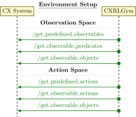
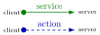
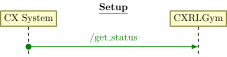
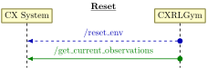
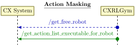
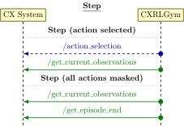
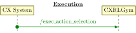

.. _cx_rl_gym:

CXRLGym - ROS 2 Reinforcement Learning Environment
##################################################

The ``CXRLGym`` module provides a ROS 2-integrated reinforcement learning (RL) environment
following the Gymnasium API. It bridges between ROS and RL frameworks
(such as Stable Baselines3), allowing agents to interact via standard Gym ``step()`` and ``reset()`` interfaces, while having a ROS based executor (e.g., the |CX| system), exchanging the relevant information va ROS communication.

Key features:

* Dynamic observation and action spaces generated from ROS 2 services.
* Symbolic robot actions executed through ROS 2 actions.
* Multi-robot support with automatic free-robot selection.
* Integration with RL models for autonomous action selection.

ROS Interfaces
**************

The ``CXRLGym`` class provides a Gymnasium-compatible environment with full ROS integration, enabling training and execution of RL policies. It fetches all relevant information such as observation and action spaces, executes environment resets and steps, and exposes action masking through ROS.

It assumes **symbolic, discrete actions** (``Discrete(n_actions)``) and **vectorized observations** (``Box`` space with shape ``(n_obs,)``).

The following standard Gymnasium interfaces are wrapped:

- **step(action: int) → tuple[np.ndarray, float, bool, bool, dict]**

  Execute a single environment step using the chosen action. Returns the next observation,
  reward, done flags, and additional info.

- **reset(seed: int = None, options: dict = None) → tuple[np.ndarray, dict]**

  Reset the environment. Returns the initial observation and metadata about the reset.

- **close()**

  Clean up environment resources.

- **action_masks() → np.ndarray**

  Return a binary mask indicating which actions are currently executable for the selected robot.

Additional functionality provided by ``CXRLGym``:

- **set_rl_model(model: object)**

  Attach an RL model for policy execution. The model must provide a ``predict(observation)`` method that returns an action. Typically, this is a Stable-Baselines3 model, but any object implementing the same interface can be used. This allows the ROS interface to remain model-agnostic.

- **on_training_end()**

  Should be called after training completes to forward training completion information via ROS.

In the following, the relevant steps for training and executing RL policies are explained along with the relevant ROS interfaces used in order to implement the functionality.

Observation and Action Space
~~~~~~~~~~~~~~~~~~~~~~~~~~~~

On initialization of the ``CXRLGym`` class, the observation and action space is defined.

The observation and action spaces are constructed by combining predefined observables/actions with all valid combinations of observable predicates/action and their objects.
Predefined observables/actions are added directly.
For each observable predicate/action, the cartesian product of the relevant parameter objects is generated to form all possible grounded predicates/actions.

The resulting observation/action space is a list of strings representing all states/actions that the RL agent can perceive.

The action space is further augmented by a default action called `no-op`, which is used to handle sitations where no action is available or all actions are masked.

Interfaces:

 * /get_predefined_observables
 * /get_observable_predicates
 * /get_observable_objects
 * /get_predefined_actions
 * /get_observable_actions

Fetching Information
~~~~~~~~~~~~~~~~~~~~~

Once the observation and action spaces have been initialized, the environment is fully set up.
Current information get be fetched from the environment at will.

This is especially useful in order to determine the current RL mode
(distinguishing between model training and using a trained model for prediction).
Also, it provides information, whether a model is currently loaded, which is required to do predictions in the first place.

.. raw:: html

    

Interfaces:

 * /get_status

Reset
~~~~~

The environment reset triggers the `/reset_env` action.
Once completed, the initial environment state is retrieved.

.. raw:: html

    

Interfaces:

 * /reset_env
 * /get_env_state

Action Masking
~~~~~~~~~~~~~~

Action masking queries which robots or objects are free and
computes which actions are currently executable. It prevents invalid
action selections during training.

.. raw:: html

    

Interfaces:

 * /get_free_robot
 * /get_action_list_executable_for_robot

Step
~~~~

During a step, the CXRLGym environment first checks whether the selected action is valid (i.e., not the special no-op action).
If the action is valid, it is executed via the action_selection action. Once execution finishes, a reward is returned and the new environment state is retrieved.

If the action is invalid (no-op), no execution occurs. Instead, the environment queries whether the episode should terminate and updates the state accordingly.

.. raw:: html

    

Interfaces:

 * /action_selection
 * /get_env_state
 * /get_episode_end

Model Execution
~~~~~~~~~~~~~~~

When executing a trained policy, the executor can use a service to request a predction/recommendation, provided the current observations and available actions.

.. raw:: html

    

Interfaces:

 * /exec_action_selection

CXRLBaseNode
************

In order to use the CXRLGym environment, a node is required that additionally provides the model.
The ``CXRLBaseNode`` class provides a generic model-agnostic base class,
encapsulating common functionality required for lifecycle and health management,
RL execution and training.
This allows derived classes to focus exclusively on algorithm-specific behavior.

The base node is responsible for:

* Initializing and managing the RL environment
* Loading or creating the RL model
* Executing training or inference depending on the selected RL mode
* Managing filesystem paths for logs, checkpoints, and trained agents
* Integrating with the ROS 2 node and lifecycle infrastructure

Concrete RL nodes are expected to inherit from ``CXRLBaseNode`` and implement
the required extension points for model creation and training logic.

RL Environment Handling
~~~~~~~~~~~~~~~~~~~~~~~

The RL environment is instantiated dynamically at runtime using a Python
entrypoint specified via parameters. The environment must implement the
Gymnasium interface and is wrapped with a Stable-Baselines3 ``Monitor`` to
enable episode-level logging and statistics collection.

The environment receives a reference to the ROS node, the selected RL mode
(training or execution), and the number of robots to manage, enabling tight
integration between ROS execution and RL interaction.

RL Modes
********

The behavior of the node is governed by the ``rl_mode`` parameter:

* ``TRAINING``
  The node executes a training loop using the configured environment and model.

* ``EXECUTION``
  The node loads a trained model and serves action selection requests without
  performing any learning.

Inferfaces
**********

Classes inheriting from ``CXRLBaseNode`` must implement the following methods:

* ``set_env()``
  Populate self.env as
  This model is assumed to provide a ``predict`` function

``set_model()``
  Load an existing RL model or create a new one and assign it to the node.
  This model is assumed to provide a ``predict`` function

``run_training()``
  Define and execute the training procedure when operating in training mode.
